# OptiOra

Multi-cloud FinOps platform with a FastAPI backend, a Next.js dashboard, and an OCI deployment path.

## Dashboard Preview



The dashboard is the main workspace for:

- multi-cloud cost overview across AWS, Azure, GCP, and OCI
- provider connection, CSV billing upload, and scan readiness checks
- anomaly detection and optimization recommendations
- deterministic forecasting with baseline/conservative/balanced/aggressive scenarios, p10/p50/p90 fan percentiles, budget guardrails, trend+smoothing blends, provider concentration (HHI), and breach-probability executive metrics
- OCI GenAI-assisted cost advisor conversations, AI insights, and advisory workflows with London South (`uk-london-1`) as the primary OCI GenAI region

## Repository Layout

- `finops_mcp/` (internal package): FastAPI backend, auth, credential and CSV import workflows, scan state, provider integrations
- `dashboard/`: Next.js dashboard UI
- `ansible/`: host provisioning and application runtime configuration
- `deploy/deploy-oci.sh`: laptop-driven OCI compute deployment
- `terraform/`: OCI network baseline
- `ARCHITECTURE.md`: current ASCII architecture and deployment flows
- `DEPLOYMENT.md`: deployment runbook

## Runtime Architecture

```text
┌──────────────────────────────────────────────┐
│                  End Users                   │
└────────────────────────┬─────────────────────┘
                         │ HTTPS
                         v
┌──────────────────────────────────────────────┐
│          Next.js Dashboard (port 3000)       │
│  - cost views and AI advisor chat            │
│  - credential, CSV import, and scan setup    │
│  - anomaly detection and recommendations     │
└────────────────────────┬─────────────────────┘
                         │ REST
                         v
┌──────────────────────────────────────────────┐
│           FastAPI Backend (port 8000)        │
│  /api/v1/credentials/*                       │
│  /api/v1/imports/costs/*                     │
│  /api/v1/scanning/*                          │
│  /api/v1/costs|anomalies|recommendations     │
│  /api/v1/provider-diagnostics                │
└───────────────┬──────────────────┬───────────┘
                │                  │
                │ SQLAlchemy       │ Cloud SDK / APIs
                v                  v
      ┌──────────────────┐   ┌───────────────────────┐
      │ SQLite/Postgres  │   │ AWS / Azure / GCP / OCI│
      │ - org mapping    │   │ cost + usage endpoints │
      │ - credentials    │   └───────────────────────┘
      │ - imported costs │
      │ - scan runs      │
      └──────────────────┘
```

## Key Behavior

- `.env` is loaded automatically when the OptiOra backend starts.
- Dashboard access is public by default. Authentication and RBAC are optional deployment hardening steps and stay disabled unless you explicitly set `ENABLE_AUTH=true` and `NEXT_PUBLIC_ENABLE_AUTH=true`.
- When auth is disabled, backend auth dependencies resolve to the seeded public workspace identity so dashboard APIs still work without login.
- Raw cloud secrets are validated server-side but not persisted; only sanitized metadata is stored.
- Workspace owners/admins can upload UTF-8 CSV billing data as an optional manual cost source. Native Excel import is intentionally not supported yet.
- OptiOra prefers live provider APIs/runtime credentials when they are configured. Imported CSV data is used as a manual fallback when live runtime access is not available.
- Provider diagnostics report missing cloud configuration without exposing secret values.
- Dashboard overview pages mark partial or fallback data explicitly if backend data is unavailable.
- Dashboard pages now expose a source-state banner so operators can see whether a view is using imported CSV data, live runtime provider data, partial backend data, or an unverified fallback state.
- Cost overview, forecasting, analytics, and recommendations are driven from either imported CSV billing data or live provider cost data — no hardcoded baselines.
- Scan approval settings can include budget/threshold guardrails that feed forecasting and analytics risk metrics.
- Credential/scanning mutations are role-guarded (`owner`/`admin`) when auth is enabled.
- AI advisor features are OCI GenAI-based; there is no parallel OpenAI/ChatGPT runtime path in this repository.
- For OCI GenAI signing, prefer `OCI_PRIVATE_KEY_PATH` over inline multiline env values. Inline `OCI_PRIVATE_KEY` is still supported when encoded with literal `\n` escapes.

## Core API Surface

- `GET /health`
- `POST /api/v1/credentials/validate`
- `POST /api/v1/credentials/add`
- `GET /api/v1/credentials`
- `DELETE /api/v1/credentials/{provider}`
- `GET /api/v1/imports/costs/summary`
- `POST /api/v1/imports/costs/csv`
- `POST /api/v1/scanning/request-approval`
- `POST /api/v1/scanning/approve`
- `GET /api/v1/scanning/permission`
- `POST /api/v1/scanning/start`
- `GET /api/v1/scanning/{scan_id}/progress`
- `GET /api/v1/scanning/history`
- `GET /api/v1/scanning/{scan_id}/diff`
- `POST /api/v1/scanning/scheduler/run-now`
- `GET /api/v1/scanning/scheduler/status`
- `GET /api/v1/scanning/history.csv`
- `GET /api/v1/scanning/{scan_id}/diff.csv`
- `GET /api/v1/costs`
- `GET /api/v1/anomalies`
- `POST /api/v1/anomalies/external/aws`
- `GET /api/v1/recommendations`
- `GET /api/v1/forecast` (budget guardrails, fan percentiles, cost velocity, backtesting)
- `GET /api/v1/analytics` (risk/maturity scores, waste, commitment, MoM velocity, GenAI narrative)
- `GET /api/v1/analytics/attribution` (Pareto cost driver analysis, HHI concentration)
- `GET /api/v1/analytics/commitment-optimization` (RI/Savings Plan ROI at 50/65/80% tiers)
- `GET /api/v1/analytics/maturity` (CRAWL/WALK/RUN/OPTIMIZE assessment, GenAI narrative)
- `GET /api/v1/analytics/unit-economics` (cost-per-resource, waste-to-spend, dollar efficiency)
- `POST /api/v1/genai/analyze` (backend OCI GenAI narration: spend / anomaly / optimization / maturity / budget-risk)
- `GET /api/v1/provider-accounts/rollups` (hierarchy tree with rolled-up costs + top_regions)
- `GET /api/v1/provider-accounts` (flat account inventory, filterable by provider)
- `GET /api/v1/provider-accounts/{id}/region-breakdown` (per-region cost rows)
- `GET /api/v1/alerts`
- `POST /api/v1/alerts/{alert_id}/acknowledge`
- `GET /api/v1/alerts/routing-policies`
- `POST /api/v1/alerts/routing-policies`
- `GET /api/v1/notifications/destinations`
- `POST /api/v1/notifications/destinations/{channel}/toggle`
- `POST /api/v1/notifications/test-destination`
- `GET /api/v1/alerts.csv`
- `GET /api/v1/audit-logs`
- `GET /api/v1/audit-logs.csv`
- `GET /api/v1/reports/executive-summary.csv`
- `GET /api/v1/reports/executive-summary.xls`
- `GET /api/v1/exports/jobs`
- `POST /api/v1/exports/jobs`
- `POST /api/v1/exports/jobs/{job_id}/run`
- `GET /api/v1/exports/jobs/{job_id}/runs`
- `POST /api/v1/anomalies/external/gcp/pubsub`
- `GET /api/v1/provider-diagnostics`
- `GET /api/v1/info`

## Local Development

Supported Python for backend setup: `3.10` through `3.13`

### One-command bootstrap

```bash
./setup.sh
```

This creates a backend virtualenv, installs dashboard dependencies, and runs Terraform init/validate.

### Backend

```bash
python3.13 -m venv .venv
source .venv/bin/activate
pip install -e .
cp .env.example .env
optiora
```

If your default `python3` resolves to `3.14`, use `python3.13` (or `python3.12`) for backend setup.

Backend default: `http://localhost:8000`
Developer override example: `optiora --port 8001 --reload`
Dashboard opens directly by default with no login wall.
CSV uploads require a migrated database schema, so run `alembic upgrade head` if your local DB predates the latest migration set.

### Dashboard

```bash
cd dashboard
npm install
npm run dev
```

Dashboard default: `http://localhost:3000`

Local frontend env:

```bash
export NEXT_PUBLIC_API_URL=http://localhost:8000
export NEXT_PUBLIC_ENABLE_AUTH=false
```

Database config:

- default local DB: SQLite via `sqlite:///./optiora.db`
- preferred override: `DATABASE_URL=...`
- legacy fallback: if `DATABASE_URL` is blank and `OCI_DB_*` vars are set, the backend derives a PostgreSQL URL automatically

## OCI Deployment

```bash
export OCI_REGION=uk-london-1
export OCI_COMPARTMENT_ID=ocid1.compartment.oc1...
./deploy/deploy-oci.sh compute
./deploy/deploy-oci.sh status
./deploy/deploy-oci.sh verify
```

Deployment script behavior:

- provisions or reuses an OCI compute instance with the latest Oracle Linux 9 platform image for the selected shape
- uploads the current local workspace snapshot
- rewrites remote `FRONTEND_URL` and `NEXT_PUBLIC_API_URL` to the instance public IP
- replaces placeholder JWT secrets with a generated value
- applies `alembic upgrade head` on the VM before services restart
- installs backend + dashboard dependencies with `dnf` on Oracle Linux hosts and starts systemd services

Optional OCI deploy environment:

- `OCI_PROFILE`: OCI CLI profile used to resolve the platform-image tenancy when `OCI_IMAGE_COMPARTMENT_ID` is not set
- `OCI_IMAGE_COMPARTMENT_ID`: explicit image compartment override for platform image lookup
- `OCI_REGION=uk-london-1`: primary OCI region for hosting and OCI GenAI inference

## Terraform + Ansible Baseline

Terraform is intentionally limited to OCI networking primitives. Ansible owns host package installation, runtime `.env` rendering, dashboard builds, systemd units, and health checks, and now supports both Debian-family hosts and Oracle Linux / RHEL hosts.

```bash
terraform -chdir=terraform init
terraform -chdir=terraform validate
terraform -chdir=terraform plan \
  -var="compartment_id=<your_compartment_ocid>" \
  -var="region=uk-london-1" \
  -var="laptop_cidr=<your_public_ip>/32"
```

Security defaults:

- ingress locked to `laptop_cidr`
- egress defaults to `0.0.0.0/0` so provisioning and cloud API access work out of the box
- override `egress_cidr` if you want a more restrictive outbound policy

Ansible provisioning:

```bash
cp ansible/inventory.example.yml ansible/inventory.yml
ansible-playbook -i ansible/inventory.yml ansible/playbooks/site.yml
```

## Verification

```bash
python3 -m py_compile $(find ./finops_* -name '*.py')
python3 -m compileall $(find ./finops_* -type d)
.venv/bin/python -m unittest discover -s tests -v

cd dashboard
npm run type-check
npm run lint
npm run build
npm run test:e2e

terraform -chdir=../terraform validate
```

OCI/public-dashboard verification:

```bash
./deploy/deploy-oci.sh verify
HOST=http://<instance-ip> bash tests/smoke_test_0_9.sh
```

`tests/smoke_test_0_9.sh` now checks health, public dashboard routes, CSV template/import flow, imported-cost activation, analytics/forecast/rollup endpoints, provider diagnostics, finance exports, and the dashboard AI route. To verify the live credential plus scan path as well, provide `SMOKE_CREDENTIAL_JSON='{"provider":"aws",...}'` (or another supported provider payload) before running it.

Forecast and analytics payloads now include budget-aware and executive-focused fields (`budget_breach_probability`, `average_breach_probability`, `provider_concentration_hhi`, `forecast_summary`, `spend_at_risk_usd`, `optimization_capacity_usd`) while keeping deterministic core math. Forecasting now prefers persisted monthly history from `CostSnapshot` rows when enough points exist, reports `history_source`/`history_coverage_months`, and includes holdout backtesting (`backtesting.mape_percent`, `backtesting.wmape_percent`) for model trust.

## CSV Billing Import

OptiOra currently supports CSV upload for optional manual billing ingestion. Excel import is not supported yet.

Required CSV columns:

- `provider`
- `cost_usd`

Optional CSV columns:

- `service_name`
- `account_identifier`
- `account_name`
- `account_type`
- `parent_account_identifier`
- `region`
- `period_start`
- `period_end`
- `currency`

Current CSV rules:

- file must be UTF-8 encoded
- `provider` must be one of `aws`, `azure`, `gcp`, or `oci`
- uploaded CSV data remains available as a manual billing source for cost, forecast, analytics, and recommendation pages when live provider runtime is not configured
- `currency` defaults to `USD` and only `USD` is currently accepted
- each new upload replaces the previous imported billing dataset for that workspace

## Documentation

- [Architecture](ARCHITECTURE.md)
- [Deployment](DEPLOYMENT.md)
- [Testing](TESTING.md)
- [Terraform](terraform/README.md)
- [Ansible](ansible/README.md)
- [Next Phase Checklist](NEXT_PHASE.md)
- [Release 1.0 Backlog](RELEASE_1_0_BACKLOG.md)
- [Competitive Integrations Backlog](COMPETITIVE_INTEGRATIONS.md)
- [Roadmap](ROADMAP.md)

## License

MIT
