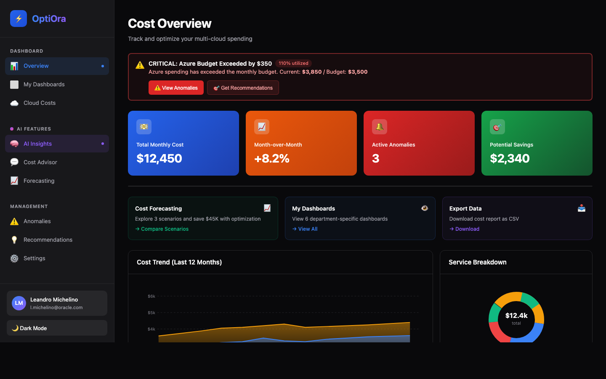

# OptiOra

Multi-cloud FinOps platform with a FastAPI backend, a Next.js dashboard, and an OCI deployment path.

## Dashboard Preview



## Repository Layout

- `finops_mcp/`: FastAPI backend, auth, credential workflows, scan state, provider integrations
- `dashboard/`: Next.js dashboard UI
- `deploy/deploy-oci.sh`: laptop-driven OCI compute deployment
- `terraform/`: OCI network baseline
- `ARCHITECTURE_COMPLETE.md`: full architecture and ASCII diagrams
- `DEPLOYMENT.md`: deployment runbook

## Runtime Architecture

```text
┌──────────────────────────────────────────────┐
│                  End Users                   │
└────────────────────────┬─────────────────────┘
                         │ HTTPS
                         v
┌──────────────────────────────────────────────┐
│          Next.js Dashboard (port 3000)       │
│  - login / signup / profile                  │
│  - cost views and AI chat                    │
│  - credential + scan setup                   │
└────────────────────────┬─────────────────────┘
                         │ REST + Bearer JWT
                         v
┌──────────────────────────────────────────────┐
│           FastAPI Backend (port 8000)        │
│  /auth/*                                     │
│  /api/v1/credentials/*                       │
│  /api/v1/scanning/*                          │
│  /api/v1/costs|anomalies|recommendations     │
└───────────────┬──────────────────┬───────────┘
                │                  │
                │ SQLAlchemy       │ Cloud SDK / APIs
                v                  v
      ┌──────────────────┐   ┌───────────────────────┐
      │ SQLite/Postgres  │   │ AWS / Azure / GCP / OCI│
      │ - users          │   │ cost + usage endpoints │
      │ - org mapping    │   └───────────────────────┘
      │ - refresh tokens │
      │ - credentials    │
      │ - scan runs      │
      └──────────────────┘
```

## Key Behavior

- `.env` is loaded automatically when the backend package is imported.
- Credential and scanning endpoints are authenticated and derive their persisted `customer_id` from the JWT user identity.
- The dashboard automatically retries protected requests with `/auth/refresh` when the access token has expired.
- Raw cloud secrets are validated but not persisted; only sanitized metadata is stored.
- The dashboard overview pages can still fall back to safe mock data if the backend is unavailable.

## Core API Surface

- `GET /health`
- `POST /auth/register`
- `POST /auth/login`
- `POST /auth/refresh`
- `GET /auth/profile`
- `PUT /auth/profile`
- `POST /auth/logout`
- `POST /auth/password-reset-request`
- `POST /api/v1/credentials/validate`
- `POST /api/v1/credentials/add`
- `GET /api/v1/credentials`
- `DELETE /api/v1/credentials/{provider}`
- `POST /api/v1/scanning/request-approval`
- `POST /api/v1/scanning/approve`
- `GET /api/v1/scanning/permission`
- `POST /api/v1/scanning/start`
- `GET /api/v1/scanning/{scan_id}/progress`
- `GET /api/v1/costs`
- `GET /api/v1/anomalies`
- `GET /api/v1/recommendations`
- `GET /api/v1/info`

## Local Development

Supported Python for backend setup: `3.10` through `3.13`

### One-command bootstrap

```bash
./setup.sh
```

This creates a backend virtualenv, installs dashboard dependencies, and runs Terraform init/validate.

### Backend

```bash
python3 -m venv .venv
source .venv/bin/activate
pip install -e .
cp .env.example .env
python -m finops_mcp.app
```

Backend default: `http://localhost:8000`

### Dashboard

```bash
cd dashboard
npm install
npm run dev
```

Dashboard default: `http://localhost:3000`

Local frontend env:

```bash
export NEXT_PUBLIC_API_URL=http://localhost:8000
```

Database config:

- default local DB: SQLite via `sqlite:///./optiora.db`
- preferred override: `DATABASE_URL=...`
- legacy fallback: if `DATABASE_URL` is blank and `OCI_DB_*` vars are set, the backend derives a PostgreSQL URL automatically

## OCI Deployment

```bash
export OCI_COMPARTMENT_ID=ocid1.compartment.oc1...
./deploy/deploy-oci.sh compute
./deploy/deploy-oci.sh status
```

Deployment script behavior:

- provisions or reuses an OCI compute instance
- uploads the current local workspace snapshot
- rewrites remote `FRONTEND_URL` and `NEXT_PUBLIC_API_URL` to the instance public IP
- replaces placeholder JWT secrets with a generated value
- installs backend + dashboard dependencies and starts systemd services

## Terraform Baseline

```bash
terraform -chdir=terraform init
terraform -chdir=terraform validate
terraform -chdir=terraform plan \
  -var="compartment_id=<your_compartment_ocid>" \
  -var="region=us-phoenix-1" \
  -var="laptop_cidr=<your_public_ip>/32"
```

Security defaults:

- ingress locked to `laptop_cidr`
- egress defaults to `0.0.0.0/0` so provisioning and cloud API access work out of the box
- override `egress_cidr` if you want a more restrictive outbound policy

## Verification

```bash
python3 -m py_compile finops_mcp/*.py finops_mcp/tools/*.py
python3 -m compileall finops_mcp

cd dashboard
npm run type-check
npm run lint
npm run build

terraform -chdir=../terraform validate
```

## Documentation

- [Architecture](ARCHITECTURE_COMPLETE.md)
- [Deployment](DEPLOYMENT.md)
- [Dashboard](DASHBOARD.md)
- [Credential Management](CREDENTIAL_MANAGEMENT.md)
- [Testing](TESTING.md)
- [Terraform](terraform/README.md)
- [Roadmap](ROADMAP.md)

## License

MIT
